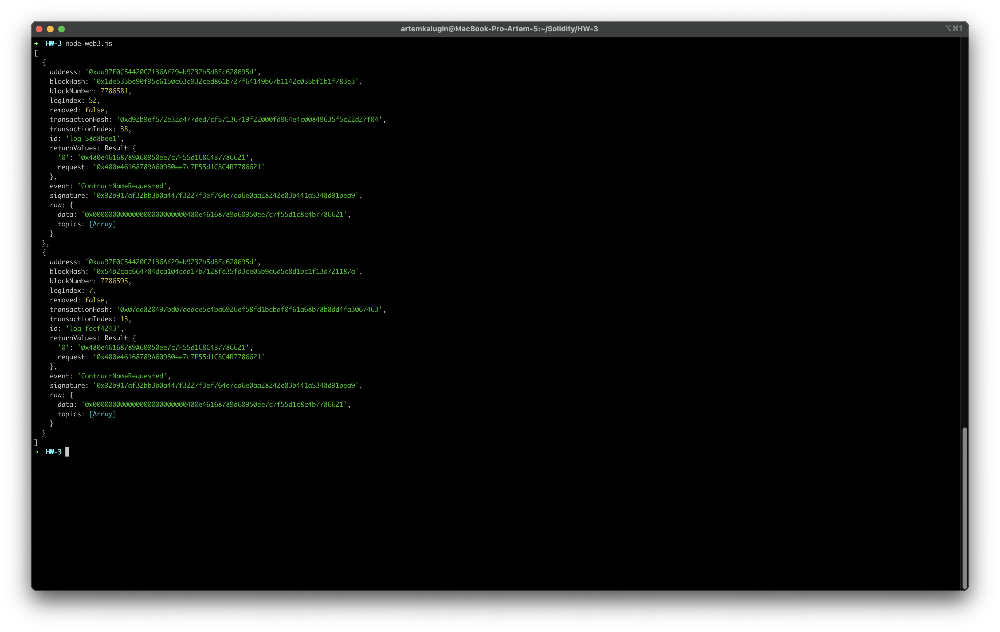

# Структура

В данной поддиректории 2 папки - js & solidity.

В директории js:

1. web3.js - исполняемый js файл для поиска всех ивентов в контракте.
2. abi.json - ABI контракта.

В директории solidity:
Обновлённый код токена с добавленным event-ом `ContractNameRequested` ( вызывается в функции name )

# Основное

Был написан скрипт для поиска всех вызванных event-ов в контракте.
На скриншоте ниже пример результата выполнения данного скрипта - было найдено 2 event-a `ContractNameRequested`.

